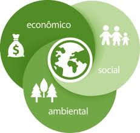

# **1.1. La Sostenibilidad y su Impacto en la Industria**

## **Definición de Sostenibilidad**

La 🌿 **sostenibilidad** es un concepto integral que busca satisfacer las necesidades del presente sin comprometer los recursos 🏞️, el medio ambiente 🌍 y el bienestar 🧑‍🤝‍🧑 de las futuras generaciones. Implica un equilibrio ⚖️ entre tres dimensiones clave: la **ambiental** 🌱, la **económica** 💰 y la **social** 🏘️. Estas dimensiones no solo se enfocan en la conservación del medio ambiente 🐾, sino también en la justicia social ✊ y la viabilidad económica 📈.

  

  

### **Los tres pilares de la sostenibilidad:**

1. **Pilar Ambiental 🌍**

    Busca preservar los ecosistemas 🏞️, minimizar el agotamiento de los recursos naturales ⛏️ y reducir la contaminación 🏭. Fomenta el uso responsable de recursos      renovables 🌱 y la disminución de residuos 🗑️ a través de prácticas como el reciclaje ♻️ y la economía circular 🔄.
        *Ejemplo: Energías renovables ☀️, tecnologías limpias ⚡ y reducción de emisiones 🌫️.*
    

2. **Pilar Económico 💰**

    Promueve el desarrollo de modelos de negocio que aseguren un crecimiento económico a largo plazo 📊. Se enfoca en la eficiencia operativa ⚙️, la reducción de       costos 💸 y la creación de valor compartido 🤝.
        *Ejemplo: Producción responsable 🏭 y gestión eficiente de recursos 🔄.*
   

3. **Pilar Social 👥**

    Busca mejorar la calidad de vida de las comunidades 🏠, garantizando condiciones laborales justas ⚖️, equidad social 🫂 y respeto por los derechos humanos 🕊️.
    Promueve la inclusión 🌍, la diversidad 🌈 y el bienestar social ❤️.
        *Ejemplo: Condiciones laborales dignas 👷, educación 📚 y acceso a servicios de salud 🏥.*

  

 

---

## Impacto de la Sostenibilidad en la Industria 🏢

Las empresas están adoptando prácticas sostenibles debido a:

✅ Regulaciones ambientales 🌍: Normativas que exigen reducir la contaminación y el uso de productos químicos tóxicos ☣️.
✅ Responsabilidad social 🤝: Se exige transparencia en la cadena de suministro y mejores condiciones laborales ⚖️.

Las compañías que se alinean con estos cambios logran operar con menor impacto ambiental 🐾 y mayor compromiso social. 

## 🚀 Innovación y Competitividad

La sostenibilidad impulsa el desarrollo de nuevas tecnologías y estrategias empresariales:
    🌿 Productos ecológicos: Uso de materiales reciclados ♻️ y procesos más eficientes.
    ⚙️ Tecnologías verdes: Desarrollo de energías renovables ☀️, vehículos eléctricos 🚗 y mejoras en eficiencia energética 🔋.
    📊 Procesos optimizados: Digitalización y automatización para reducir el desperdicio de recursos.

Las empresas que invierten en innovación sostenible logran una ventaja competitiva 🏆 y reducen costos operativos 💸. Los consumidores 🛒 son cada vez más exigentes con las marcas y buscan aquellas que protejan el medio ambiente 💚 (uso eficiente del agua 💧, reducción de residuos ♻️ y energías limpias ⚡) y que sean responsables socialmente (promoción de condiciones laborales justas 👷, diversidad 🌈 e inclusión 🫂).

El compromiso con la sostenibilidad fortalece la imagen de la marca 🏆 y genera mayor fidelidad en los clientes 💼. La sostenibilidad es un factor clave en la inversión y el financiamiento empresarial. Inversiones verdes 🌱: Los inversores priorizan empresas con criterios ambientales, sociales y de gobernanza (ESG) 🏛️. Incentivos fiscales: Existen beneficios gubernamentales 💸 para compañías que adoptan prácticas sostenibles. Las empresas sostenibles acceden a mejores condiciones de financiamiento 📈 y pueden expandirse con menor riesgo financiero.
