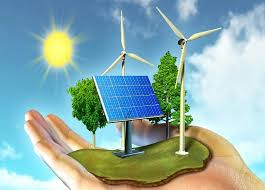

# 🌍 1.2. La Importancia de las Energías Renovables en la Transición Ecológica

Las energías renovables juegan un papel fundamental en la transición hacia un futuro más sostenible 🌍. Su importancia radica en múltiples aspectos que benefician tanto al medio ambiente 🌱 como a la sociedad 🏘️.

  

  

---
## **🌿 Beneficios Ambientales**

La reducción de emisiones 🌫️ de gases de efecto invernadero es uno de los principales beneficios, ya que las energías renovables no emiten CO₂ ni otros contaminantes durante su operación. Esto contribuye directamente a la lucha contra el cambio climático ❄️ y al cumplimiento de los objetivos del Acuerdo de París 📜.

Al depender de fuentes inagotables como el sol ☀️, el viento 💨 y el agua 💧, estas energías garantizan un suministro energético sostenible sin agotar los recursos naturales del planeta 🌎.

---
## **💰 Impacto Socioeconómico**

La transición hacia las energías renovables fortalece la independencia energética ⚡ de los países, reduciendo su dependencia de combustibles fósiles ⛽ importados. Además, fomenta el desarrollo de industrias locales 🏭 y la creación de empl  eo 👷 en sectores emergentes.

La calidad del aire 🌬️ mejora significativamente al eliminar la emisión de contaminantes, lo que se traduce en beneficios directos para la salud pública 🏥, especialmente en la reducción de enfermedades respiratorias 🤧 y cardiovasculares ❤️.

---
## **🚀 Innovación y Resiliencia**

El sector de las energías renovables impulsa la innovación tecnológica 🧪 en áreas como:
🔋 Almacenamiento de energía  
🚗 Movilidad eléctrica  
💨 Hidrógeno verde  

Esta diversificación energética 🔄 aumenta la resiliencia ante crisis geopolíticas 🌍 y fluctuaciones en los precios de los combustibles fósiles 📉, contribuyendo a un futuro más estable y sostenible 🌿.
