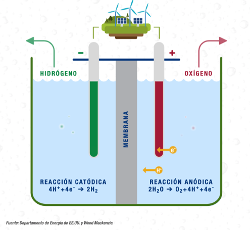

# **2.2. Producción mediante electrólisis del agua con energías renovables 💧⚡🌿**

## **¿Qué es la electrólisis del agua 🤔?** 

El hidrógeno verde 🟢 se elabora mediante el proceso de electrólisis del agua, que consiste en separar las moléculas del agua 💦 de hidrógeno y oxígeno mediante el empleo de electricidad ⚡ procedente de fuentes renovables 🌞🌬️.  
Para la producción del hidrógeno, la electrólisis convierte la energía química 🔬🧪 almacenando electrones en enlaces químicos estables. Los electrolizadores se componen de un ánodo y un cátodo separados por un electrolito.  
Para lograr la electrolisis, es necesario el uso de electrolizadores PEM (Proton Exchange Membrane) 🔋.
 

  

  

### Paso a paso del proceso:

  **Entrada de agua 💧 y electricidad ⚡:**  
  
        1. Se introduce agua en el electrolizador. 🚰
        2. Se aplica electricidad a través de dos electrodos. ⚡  

  **Reacción en el ánodo (electrodo positivo) ➕:**  
  
        1. El agua (H₂O) llega al ánodo y se divide en oxígeno (O₂), protones (H⁺) y electrones (e⁻) 💧➡️💨.
        2. El oxígeno (O₂) se libera como un gas 💨.
        3. Los protones (H⁺) atraviesan la membrana PEM hacia el otro lado 🏃‍♂️.
        4. Los electrones (e⁻) fluyen a través de un circuito externo (generando corriente eléctrica) ⚡.
 

  **Reacción en el cátodo (electrodo negativo):**  
  
        Los protones (H⁺) que cruzaron la membrana se combinan con los electrones (e⁻) que viajaron por el circuito externo 🤝.
        Como resultado, se forma hidrógeno gaseoso (H₂), que se recoge y almacena 💨🎈.

  **Producción final:**  
  
        Se obtiene hidrógeno (H₂) en un lado del sistema y oxígeno (O₂) en el otro 💨💨.  
        Este hidrógeno se puede almacenar y usar como combustible limpio, ya que al quemarse 🔥 solo produce agua 💧.  
