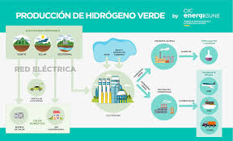

# 🌱 Hidrógeno Verde: Concepto y Producción 🌱

El **hidrógeno verde** es una fuente de energía limpia y sostenible que se produce mediante la electrólisis del agua utilizando **energía renovable** como la solar 🌞, eólica 🌬️ o hidroeléctrica 🌊. A diferencia del hidrógeno producido de manera convencional, que emite grandes cantidades de **CO₂**, el hidrógeno verde se destaca por sus ventajas tanto ambientales como tecnológicas.

  

  

## 🌟 Ventajas del Hidrógeno Verde 🌟

### 1. 🚫 **No genera CO₂**
El hidrógeno verde es **completamente limpio**, ya que **no genera emisiones de CO₂** durante su producción ni cuando se utiliza como fuente de energía. Esta característica lo convierte en una opción clave para la lucha contra el **cambio climático** 🌍. A medida que la sociedad avanza hacia la descarbonización, el hidrógeno verde juega un papel crucial en la reducción de gases de efecto invernadero.

### 2. 🏠 **Almacenable**
El hidrógeno verde puede **almacenarse de manera eficiente**, lo que lo convierte en una excelente opción para **gestionar la energía** en sistemas intermitentes de energías renovables (como la solar o eólica). Almacenarlo permite su uso **cuando se necesite**, incluso en momentos de baja producción de energía renovable. ¡Es energía disponible en cualquier momento! ⏳🔋

### 3. 🔄 **Versátil**
El hidrógeno verde es **extremadamente versátil** y puede utilizarse en diversas aplicaciones:
- **Transporte 🚗**: Se utiliza en vehículos de celda de combustible (coches, autobuses, camiones) para transporte limpio.
- **Industria 🏭**: Se emplea como materia prima en procesos industriales, como la producción de acero, fertilizantes y productos químicos.
- **Generación de electricidad ⚡**: Se puede usar para generar electricidad a través de pilas de combustible.
- **Calefacción 🔥**: El hidrógeno verde también es utilizado para la calefacción de viviendas y edificios.

Su capacidad para integrarse en diferentes sectores lo convierte en una pieza clave en la transición energética hacia un futuro más sostenible.

  

  

## 🌍 **Impacto del Hidrógeno Verde**
Las ventajas del hidrógeno verde son claras: no produce **CO₂**, es **almacenable** para su uso posterior y es **versátil** en diversas aplicaciones. Esto lo convierte en una de las soluciones más prometedoras para combatir el cambio climático y contribuir a la **descarbonización de la economía global**. 🌱🔋🌞

---

### 🚀 **Conclusión**
El hidrógeno verde es un **pilar fundamental** en la transición hacia un modelo energético más limpio y sostenible.🌍🌿

