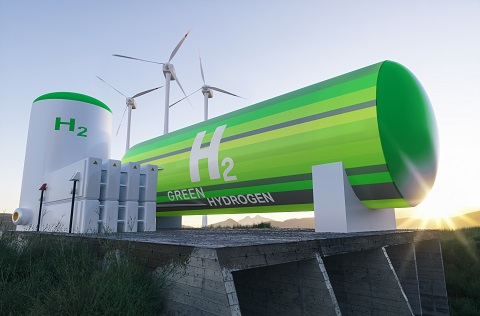

# 2.4. Hidrógeno Verde: Inconvenientes

El hidrógeno verde es una alternativa energética sostenible con un gran potencial para reducir las emisiones de carbono. Sin embargo, presenta varios inconvenientes que limitan su adopción masiva en la actualidad:

  

  

## **1. ⚡ Costes Elevados**
- La producción de hidrógeno verde mediante electrólisis es costosa debido al alto precio de la electricidad renovable 🌞💨 y la tecnología utilizada.
- Los electrolizadores requieren materiales caros como el platino e iridio, lo que incrementa el costo total.
- La infraestructura de almacenamiento y distribución también implica inversiones significativas.

---
## **2. 🔋 Eficiencia Limitada**
- La conversión de electricidad en hidrógeno y su posterior reconversión en electricidad tiene pérdidas energéticas considerables.
- En comparación con baterías eléctricas 🔋, el hidrógeno verde presenta menor eficiencia en el ciclo energético.
- La eficiencia de los electrolizadores aún está en desarrollo y no alcanza niveles óptimos para una adopción masiva.

---
## **3. 🏗️ Infraestructura Escasa**
- La falta de una red de distribución de hidrógeno verde limita su disponibilidad y encarece su transporte 🚚.
- Actualmente, existen pocas estaciones de repostaje para vehículos de hidrógeno 🚗💨, lo que dificulta su uso en el sector del transporte.
- La adaptación de infraestructuras industriales para el uso de hidrógeno requiere inversiones importantes.

---
## **4. 🏭 Almacenamiento y Transporte Complejos**
- El hidrógeno tiene una baja densidad energética por volumen, lo que dificulta su almacenamiento y transporte eficiente.
- Requiere altas presiones, temperaturas extremadamente bajas ❄️ o conversión a otros compuestos como amoníaco 🧪 o metanol, lo que encarece su manejo.

---
## **5. ☀️ Dependencia de Energía Renovable**
- Su producción depende de fuentes de energía renovable (solar 🌞, eólica 💨, hidroeléctrica 🌊), que pueden ser intermitentes y requerir almacenamiento energético adicional.
- La competencia con otros sectores por el uso de energías renovables podría limitar su disponibilidad.

---
## **6. ⚖️ Desafíos Regulatorios y Políticos**
- La falta de regulaciones y normativas claras para su producción, distribución y seguridad ralentiza su adopción.
- Los incentivos gubernamentales aún son insuficientes en muchos países para impulsar su desarrollo.

A pesar de estos inconvenientes, el hidrógeno verde sigue siendo una alternativa prometedora para la transición energética, y se espera que futuras innovaciones reduzcan sus costos y mejoren su eficiencia.

