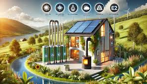

# 4.3. Viviendas: Calefacción y almacenamiento energético 🔥🏠.

  

  

La principal ventaja del hidrógeno es que, cuando se quema, no libera elementos contaminantes a la atmósfera 🌍💨 y su gran inconveniente es que se almacena, distribuye y consume en estado gaseoso 💨, lo que dificulta su almacenamiento y el transporte 🚚. Pero no son el único pro ni contra de este gas:

## **A favor:**
- Fuente de energía renovable y limpia 🌱⚡: Su combustión solo emite vapor de agua 💧 y no deja residuos en el aire 🌫️.
- No es tóxico ☠️🚫: Cuando se quema en una caldera no tiene el mismo peligro que el monóxido de carbono, porque no es tóxico ni corrosivo.
- Es eficiente 🔥: Tiene un poder calorífico por cada kg de combustible 3 veces superior al de otros combustibles.

## **En contra:**
Elevado coste de producción 💸: Con el método tradicional de electrólisis ⚡, para producir 2,99 kWh de energía se tienen que gastar 2,83 kWh de electricidad. Según la Agencia Internacional de la Energía 🌍⚡, 1 kg de hidrógeno verde cuesta entre 3,50 y 5 euros, lo que supone entre 0,10 y 0,15 euros/kWh.
    
## **Proceso de producción 🔧:** 
Es un tipo de energía que se tiene que fabricar.

## **Seguridad ⚠️:** 
Es una sustancia volátil e inflamable 🔥, como el gas natural, por lo que implica cierto riesgo 🚨. Es difícil de detectar por ser inoloro e incoloro, pero resulta menos peligroso que el gas natural, propano o butano.

## **Difícil de almacenar 🏗️:** 
Es un combustible que ocupa mucho sitio 🏠, debido a su baja densidad, por lo que se necesitan depósitos más grandes y tuberías más gruesas 🛢️.

## **Hidrógeno como vector energético 💡:**

El hidrógeno como vector energético es versátil y tiene múltiples aplicaciones 🔄. Su uso no genera partículas, óxidos de azufre, óxidos de nitrógeno ni ozono troposférico 🌬️, pero sí puede generar emisiones significativas, especialmente de CO₂ 🌍.
